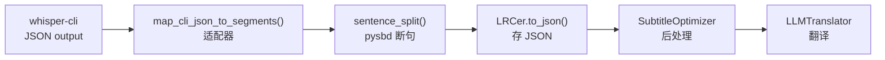

# OpenLRC → Whisper.cpp (CLI Subprocess) 改进版迁移实施方案

> 本方案基于对 [whisper.cpp/examples/cli/cli.cpp](file:///Users/fuzuorui/Documents/agent_play/openlrc_mac/whisper.cpp/examples/cli/cli.cpp) 源码的逐行阅读，以及 OpenLRC 核心模块 ([transcribe.py](file:///Users/fuzuorui/Documents/agent_play/openlrc_mac/openlrc/transcribe.py), [openlrc.py](file:///Users/fuzuorui/Documents/agent_play/openlrc_mac/openlrc/openlrc.py), [opt.py](file:///Users/fuzuorui/Documents/agent_play/openlrc_mac/openlrc/opt.py), [config.py](file:///Users/fuzuorui/Documents/agent_play/openlrc_mac/openlrc/config.py), [defaults.py](file:///Users/fuzuorui/Documents/agent_play/openlrc_mac/openlrc/defaults.py)) 的完整分析而成。所有 CLI 参数、JSON 格式、时间单位均已通过源码验证。

---

## 一、迁移目标与原则

**核心目标**：将 OpenLRC 的 ASR 后端从 `faster-whisper` (Python/CUDA) 替换为 [whisper.cpp](file:///Users/fuzuorui/Documents/agent_play/openlrc_mac/whisper.cpp/src/whisper.cpp) CLI (Metal/跨平台)，在 macOS 上获得 Metal GPU 加速。

**最小侵入原则**：
- ✅ **不动**：[LRCer](file:///Users/fuzuorui/Documents/agent_play/openlrc_mac/openlrc/openlrc.py#39-801), [SubtitleOptimizer](file:///Users/fuzuorui/Documents/agent_play/openlrc_mac/openlrc/opt.py#35-283), `LLMTranslator`, [agents.py](file:///Users/fuzuorui/Documents/agent_play/openlrc_mac/tests/test_agents.py), [chatbot.py](file:///Users/fuzuorui/Documents/agent_play/openlrc_mac/tests/test_chatbot.py), [subtitle.py](file:///Users/fuzuorui/Documents/agent_play/openlrc_mac/tests/test_subtitle.py), [preprocess.py](file:///Users/fuzuorui/Documents/agent_play/openlrc_mac/tests/test_preprocess.py)
- ✅ **仅改**：[transcribe.py](file:///Users/fuzuorui/Documents/agent_play/openlrc_mac/openlrc/transcribe.py), [config.py](file:///Users/fuzuorui/Documents/agent_play/openlrc_mac/openlrc/config.py), [defaults.py](file:///Users/fuzuorui/Documents/agent_play/openlrc_mac/openlrc/defaults.py)
- ✅ **新增**：`whisper_backend.py`（底层 subprocess 通信）

---

## 二、数据流分析 — 确定适配边界



**关键适配点**：[sentence_split()](file:///Users/fuzuorui/Documents/agent_play/openlrc_mac/openlrc/transcribe.py#136-349) 要求 Segment 必须包含 `words: list[Word]`（每个 Word 含 `.start`, `.end`, `.word`, `.probability`）。只要适配器正确产出这些字段，下游全部无需改动。

---

## Proposed Changes

### 数据类型层

#### [NEW] [whisper_types.py](file:///Users/fuzuorui/Documents/agent_play/openlrc_mac/openlrc/whisper_types.py)

定义替代 `faster_whisper.transcribe.Segment` 和 `Word` 的数据类。使用 `@dataclass` 而非 `namedtuple`，确保字段顺序和属性名与 `faster-whisper` 完全一致，因为 [sentence_split()](file:///Users/fuzuorui/Documents/agent_play/openlrc_mac/openlrc/transcribe.py#136-349) 中 [seg_from_words()](file:///Users/fuzuorui/Documents/agent_play/openlrc_mac/openlrc/transcribe.py#158-188) 使用位置参数构造 `Segment`。

```python
"""
替代 faster_whisper 的 Segment / Word 数据类型。

Design Decision:
  使用 @dataclass 而非 namedtuple，原因：
  1. faster_whisper.Segment 本身是 NamedTuple，但 sentence_split 中的
     seg_from_words() 使用位置参数重新构造 Segment，@dataclass 同样支持
  2. @dataclass 支持属性修改，更灵活
  3. 比 namedtuple 易于 IDE 索引和 type hint
"""
from dataclasses import dataclass, field


@dataclass
class Word:
    """词级时间戳单元，对齐 faster_whisper.transcribe.Word 的字段签名。"""
    start: float
    end: float
    word: str
    probability: float


@dataclass
class Segment:
    """段级转录单元，对齐 faster_whisper.transcribe.Segment 的字段签名。

    字段顺序必须与 faster_whisper.Segment (NamedTuple) 一致，
    因为 sentence_split.seg_from_words() 使用位置参数构造。
    """
    id: int
    seek: int
    start: float
    end: float
    text: str
    tokens: list
    avg_logprob: float
    compression_ratio: float
    no_speech_prob: float
    words: list[Word] | None
    temperature: float
```

---

### 底层通信层

#### [NEW] [whisper_backend.py](file:///Users/fuzuorui/Documents/agent_play/openlrc_mac/openlrc/whisper_backend.py)

负责 subprocess 调用 `whisper-cli`，处理双管道 IO 和进度回调。

```python
"""
WhisperCLIBackend: 通过 subprocess 调用 whisper-cli 二进制的底层桥接层。

Tool Isolation: 所有与外部进程的交互封装在此模块中。
"""
import json
import logging
import queue
import re
import shutil
import subprocess
import tempfile
import threading
from pathlib import Path
from typing import Callable

logger = logging.getLogger(__name__)


def _find_cli(cli_path: str) -> str:
    """校验 whisper-cli 可执行文件是否存在。

    Args:
        cli_path: whisper-cli 可执行文件路径或名称。

    Returns:
        解析后的可执行文件完整路径。

    Raises:
        FileNotFoundError: 找不到可执行文件。
    """
    resolved = shutil.which(cli_path)
    if resolved is None:
        raise FileNotFoundError(
            f"whisper-cli not found at '{cli_path}'. "
            "Install via: brew install whisper-cpp, "
            "or build from source with Metal support, "
            "or set cli_path to the full path."
        )
    return resolved


class WhisperCLIBackend:
    """封装 whisper-cli subprocess 调用的底层通信接口。

    Args:
        cli_path: whisper-cli 可执行文件路径。
        model_path: Whisper GGML 模型文件路径。
        vad_model_path: Silero VAD 模型文件路径（为空则不启用 VAD）。
    """

    def __init__(self, cli_path: str, model_path: str, vad_model_path: str = ""):
        self.cli_path = _find_cli(cli_path)
        self.model_path = model_path
        self.vad_model_path = vad_model_path

    def transcribe(
        self,
        audio_path: str,
        lang: str | None = None,
        progress_cb: Callable[[int], None] | None = None,
        extra_args: list[str] | None = None,
    ) -> dict:
        """调用 whisper-cli 进行转录推理。

        Args:
            audio_path: 音频文件路径。
            lang: 语言代码（None 则自动检测）。
            progress_cb: 进度回调函数，接收 0-100 的整数百分比。
            extra_args: 额外的 CLI 参数列表。

        Returns:
            whisper-cli 输出的 JSON dict。

        Raises:
            RuntimeError: whisper-cli 进程非零退出。
        """
        # === 构建命令 ===
        # 使用 -of - 将 JSON 管道输出至 stdout（源码确认：
        #   cli.cpp L1085: is_stdout{fname_out == "-"}
        #   cli.cpp L1104: fout = std::ofstream{"/dev/stdout"}
        # ）
        cmd = [
            self.cli_path,
            "-m", self.model_path,
            "-f", audio_path,
            "-ojf",                    # --output-json-full: 含 token 级详细信息
            "-of", "-",                # 输出至 stdout
            "-pp",                     # --print-progress: 启用进度打印
            "--no-prints",             # 禁用普通日志（不影响 progress callback）
        ]

        # 语言设置
        if lang:
            cmd.extend(["-l", lang])
        else:
            cmd.extend(["-l", "auto"])  # 自动检测

        # VAD 设置
        if self.vad_model_path:
            cmd.extend(["--vad", "-vm", self.vad_model_path])

        # 额外参数
        if extra_args:
            cmd.extend(extra_args)

        logger.info(f"Running whisper-cli: {' '.join(cmd)}")

        # === 启动进程 ===
        proc = subprocess.Popen(
            cmd,
            stdout=subprocess.PIPE,
            stderr=subprocess.PIPE,
            text=True,
        )

        # === stderr 进度解析线程 ===
        # 独立 daemon 线程持续排空 stderr，避免 pipe buffer 满导致死锁
        stderr_lines: list[str] = []
        stderr_q: queue.Queue[str] = queue.Queue()

        def _drain_stderr() -> None:
            assert proc.stderr is not None
            for line in proc.stderr:
                stderr_q.put(line)
                stderr_lines.append(line)

        t = threading.Thread(target=_drain_stderr, daemon=True)
        t.start()

        # 主线程轮询进度
        # whisper-cli 进度格式: "whisper_print_progress_callback: progress =  12%"
        progress_pattern = re.compile(r"progress\s*=\s*(\d+)%")
        while proc.poll() is None:
            try:
                line = stderr_q.get(timeout=0.1)
                m = progress_pattern.search(line)
                if m and progress_cb:
                    progress_cb(int(m.group(1)))
            except queue.Empty:
                continue

        # 排空残余 stderr
        t.join(timeout=5.0)
        while not stderr_q.empty():
            try:
                line = stderr_q.get_nowait()
                m = progress_pattern.search(line)
                if m and progress_cb:
                    progress_cb(int(m.group(1)))
            except queue.Empty:
                break

        # === 读取 stdout JSON ===
        assert proc.stdout is not None
        stdout_data = proc.stdout.read()

        if proc.returncode != 0:
            error_log = "".join(stderr_lines)
            raise RuntimeError(
                f"whisper-cli exited with code {proc.returncode}:\n{error_log}"
            )

        if not stdout_data.strip():
            raise RuntimeError(
                "whisper-cli produced no output. stderr:\n"
                + "".join(stderr_lines)
            )

        return json.loads(stdout_data)
```

> [!IMPORTANT]
> **管道 vs 临时文件的取舍**：上述方案默认使用 `-of -` 管道输出。如果未来遇到超长音频（数小时级别）导致 pipe buffer 阻塞问题，可退回至 `tempfile` 方案：
> ```python
> # 备用方案：用临时文件替代管道
> with tempfile.TemporaryDirectory() as tmpdir:
>     output_prefix = str(Path(tmpdir) / "output")
>     cmd = [..., "-ojf", "-of", output_prefix]
>     subprocess.run(cmd, ...)
>     with open(f"{output_prefix}.json") as f:
>         return json.load(f)
> ```

---

### 适配器层

#### [MODIFY] [transcribe.py](file:///Users/fuzuorui/Documents/agent_play/openlrc_mac/openlrc/transcribe.py)

重写核心文件。主要变更：
1. 移除 `faster_whisper` import，改用 `whisper_types`
2. 新增 `map_cli_json_to_segments()` 适配器函数
3. 重写 `Transcriber.__init__()` 和 `Transcriber.transcribe()`
4. [sentence_split()](file:///Users/fuzuorui/Documents/agent_play/openlrc_mac/openlrc/transcribe.py#136-349) 无需任何改动

```python
# === 新的 import 区 ===
from pathlib import Path
from typing import NamedTuple

import pysbd
from pysbd.languages import LANGUAGE_CODES
from tqdm import tqdm

from openlrc.defaults import default_whisper_cpp_options  # 新增
from openlrc.logger import logger
from openlrc.utils import Timer, format_timestamp, get_audio_duration, spacy_load
from openlrc.whisper_backend import WhisperCLIBackend
from openlrc.whisper_types import Segment, Word


# TranscriptionInfo 保持不变
class TranscriptionInfo(NamedTuple):
    language: str
    duration: float
    duration_after_vad: float

    @property
    def vad_ratio(self):
        return 1 - self.duration_after_vad / self.duration


# === 新增：JSON -> Segment 适配器 ===
def _parse_timestamp_str(ts: str) -> float:
    """解析 whisper.cpp 时间戳字符串为秒数。

    whisper.cpp JSON 的 timestamps.from/to 格式为 "HH:MM:SS.mmm"
    (源码 cli.cpp L687: to_timestamp(t0, true) 输出 SRT 格式)

    Args:
        ts: 时间戳字符串，例如 "00:00:01.500"

    Returns:
        浮点秒数
    """
    # 格式: "HH:MM:SS.mmm" 或 "HH:MM:SS,mmm"
    ts = ts.replace(",", ".")
    parts = ts.split(":")
    if len(parts) == 3:
        h, m, s = parts
        return int(h) * 3600 + int(m) * 60 + float(s)
    elif len(parts) == 2:
        m, s = parts
        return int(m) * 60 + float(s)
    else:
        return float(ts)


def map_cli_json_to_segments(cli_json: dict) -> list[Segment]:
    """将 whisper-cli -ojf 输出的 JSON 转换为 Segment 列表。

    JSON 结构（-ojf 模式，源码验证于 cli.cpp L725-L765）:
    {
      "result": {"language": "en"},
      "transcription": [
        {
          "timestamps": {"from": "00:00:00.000", "to": "00:00:03.000"},
          "offsets": {"from": 0, "to": 3000},   // 毫秒（cli.cpp L691: t0*10）
          "text": "hello world",
          "tokens": [
            {
              "text": "hello",
              "timestamps": {"from": "00:00:00.000", "to": "00:00:01.500"},
              "offsets": {"from": 0, "to": 1500},
              "id": 123,
              "p": 0.95,
              "t_dtw": -1.0
            }, ...
          ]
        }, ...
      ]
    }

    Args:
        cli_json: whisper-cli 的 JSON 输出 dict。

    Returns:
        Segment 列表，每个 Segment 包含带 Word 级时间戳的 words 列表。
    """
    segments: list[Segment] = []

    for i, seg in enumerate(cli_json.get("transcription", [])):
        # --- Segment 级时间 ---
        # offsets 值为毫秒（源码 cli.cpp L691: value_i("from", t0 * 10, ...)
        #   其中 t0 是 centiseconds，乘以 10 得到 milliseconds）
        seg_start = seg["offsets"]["from"] / 1000.0
        seg_end = seg["offsets"]["to"] / 1000.0
        seg_text = seg.get("text", "").strip()

        # --- Token/Word 级时间 ---
        words: list[Word] = []
        for tok in seg.get("tokens", []):
            tok_text = tok.get("text", "")
            # 跳过特殊 token（如 [SOT], [EOT] 等）
            if tok_text.startswith("[") and tok_text.endswith("]"):
                continue
            if not tok_text.strip():
                continue

            # 优先用 offsets（精确整数毫秒），回退用 timestamps（字符串）
            if "offsets" in tok:
                w_start = tok["offsets"]["from"] / 1000.0
                w_end = tok["offsets"]["to"] / 1000.0
            elif "timestamps" in tok:
                w_start = _parse_timestamp_str(tok["timestamps"]["from"])
                w_end = _parse_timestamp_str(tok["timestamps"]["to"])
            else:
                # 无时间戳的 token，使用 segment 级时间作为 fallback
                w_start = seg_start
                w_end = seg_end

            probability = tok.get("p", 0.0)
            words.append(Word(
                start=w_start,
                end=w_end,
                word=tok_text,
                probability=probability,
            ))

        # 过滤空 words 的 segment（sentence_split 会 assert words is not None）
        if not words:
            logger.warning(f"Segment {i} has no valid words, skipping: '{seg_text}'")
            continue

        segments.append(Segment(
            id=i,
            seek=0,
            start=seg_start,
            end=seg_end,
            text=seg_text,
            tokens=[],        # OpenLRC 下游不使用 raw token IDs
            avg_logprob=0.0,
            compression_ratio=0.0,
            no_speech_prob=0.0,
            words=words,
            temperature=0.0,
        ))

    return segments


# === 重写 Transcriber ===
class Transcriber:
    """使用 whisper-cli 的转录器。

    Attributes:
        cli_backend: WhisperCLIBackend 实例。
        continuous_scripted: 连续书写语言列表。
    """

    def __init__(
        self,
        model_name: str = "ggml-large-v3-turbo.bin",
        cli_path: str = "whisper-cli",
        vad_model: str = "",
        asr_options: dict | None = None,
        # 以下参数保留签名兼容但不再使用
        compute_type: str = "float16",
        device: str = "auto",
        vad_filter: bool = True,
        vad_options: dict | None = None,
    ):
        self.model_name = model_name
        self.continuous_scripted = [
            "ja", "zh", "zh-cn", "th", "vi", "lo", "km", "my", "bo"
        ]
        self.asr_options = asr_options or {}

        self.cli_backend = WhisperCLIBackend(
            cli_path=cli_path,
            model_path=model_name,
            vad_model_path=vad_model if vad_filter else "",
        )

    def transcribe(
        self, audio_path: str | Path, language: str | None = None
    ) -> tuple[list[Segment], TranscriptionInfo]:
        """转录音频文件。

        Args:
            audio_path: 音频文件路径。
            language: 语言代码，None 则自动检测。

        Returns:
            (segments, info) 元组。
        """
        total_duration = get_audio_duration(audio_path)

        # 进度条
        pbar = tqdm(total=100, unit="%", desc="Transcribing")

        def _progress_cb(pct: int) -> None:
            pbar.update(pct - pbar.n)

        # 调用 whisper-cli
        cli_json = self.cli_backend.transcribe(
            audio_path=str(audio_path),
            lang=language,
            progress_cb=_progress_cb,
            extra_args=self._build_extra_args(),
        )
        pbar.close()

        # JSON -> Segment
        segments = map_cli_json_to_segments(cli_json)

        # 语言检测结果
        detected_lang = (
            language
            or cli_json.get("result", {}).get("language", "en")
        )

        # 估算 VAD 后时长（累加所有 segment 的有效时长）
        duration_after_vad = sum(s.end - s.start for s in segments)
        if duration_after_vad == 0:
            duration_after_vad = total_duration

        info = TranscriptionInfo(
            language=detected_lang,
            duration=total_duration,
            duration_after_vad=duration_after_vad,
        )

        if not segments:
            logger.warning(f"No speech found for {audio_path}")
            result = []
        else:
            with Timer("Sentence Segmentation"):
                result = self.sentence_split(segments, info.language)

        logger.info(
            f"VAD removed {format_timestamp(info.duration - info.duration_after_vad)}s "
            f"of silence ({info.vad_ratio * 100:.1f}%)"
        )
        if info.vad_ratio > 0.5:
            logger.warning(
                f"VAD ratio is too high, check audio quality. "
                f"VAD ratio: {info.vad_ratio:.2f}"
            )

        return result, info

    def _build_extra_args(self) -> list[str]:
        """从 asr_options 构建额外的 CLI 参数。"""
        args: list[str] = []
        opts = self.asr_options

        if opts.get("beam_size", 5) > 1:
            args.extend(["-bs", str(opts["beam_size"])])
        if opts.get("best_of", 5) > 1:
            args.extend(["-bo", str(opts["best_of"])])
        if opts.get("initial_prompt"):
            args.extend(["--prompt", str(opts["initial_prompt"])])
        if opts.get("temperature", 0.0) != 0.0:
            args.extend(["-t", str(opts["temperature"])])
        if opts.get("suppress_nst", False):
            args.append("-sns")

        return args

    def sentence_split(self, segments: list[Segment], lang: str):
        # ... (完全保持原有实现不变，只是 Segment/Word 类型来源改变)
        ...
```

> [!NOTE]
> [sentence_split()](file:///Users/fuzuorui/Documents/agent_play/openlrc_mac/openlrc/transcribe.py#136-349) 方法的代码**完全不变**，只需将文件顶部的 `from faster_whisper.transcribe import Segment, Word` 替换为 `from openlrc.whisper_types import Segment, Word`。

---

### 配置层

#### [MODIFY] [config.py](file:///Users/fuzuorui/Documents/agent_play/openlrc_mac/openlrc/config.py)

[TranscriptionConfig](file:///Users/fuzuorui/Documents/agent_play/openlrc_mac/openlrc/config.py#10-31) 新增 whisper.cpp 专属字段：

```diff
 @dataclass
 class TranscriptionConfig:
     whisper_model: str = "large-v3"
+    cli_path: str = "whisper-cli"
+    vad_model: str = ""
     compute_type: str = "float16"
     device: str = "cuda"
     asr_options: dict | None = None
     vad_options: dict | None = None
     preprocess_options: dict | None = None
```

- `cli_path`: whisper-cli 可执行文件路径，默认从 `$PATH` 查找
- `vad_model`: Silero VAD 模型路径，为空则不启用原生 VAD

---

#### [MODIFY] [defaults.py](file:///Users/fuzuorui/Documents/agent_play/openlrc_mac/openlrc/defaults.py)

新增 whisper.cpp 的默认参数映射：

```python
# whisper.cpp CLI 可用参数映射（仅保留与原 faster-whisper 语义可对齐的子集）
default_whisper_cpp_options = {
    "beam_size": 5,
    "best_of": 5,
    "temperature": 0.0,
    "initial_prompt": None,
    "suppress_nst": False,          # -sns
}
```

---

#### [MODIFY] [openlrc.py](file:///Users/fuzuorui/Documents/agent_play/openlrc_mac/openlrc/openlrc.py)

1. `TYPE_CHECKING` 块中的 `from faster_whisper.transcribe import Segment` → `from openlrc.whisper_types import Segment`
2. [transcriber](file:///Users/fuzuorui/Documents/agent_play/openlrc_mac/openlrc/openlrc.py#169-185) property 中传入新参数：

```diff
  @property
  def transcriber(self):
      if self._transcriber is None:
          from openlrc.transcribe import Transcriber
          with self._transcriber_lock:
              if self._transcriber is None:
                  self._transcriber = Transcriber(
                      model_name=self._transcription_config.whisper_model,
-                     compute_type=self._transcription_config.compute_type,
-                     device=self._transcription_config.device,
+                     cli_path=self._transcription_config.cli_path,
+                     vad_model=self._transcription_config.vad_model,
                      asr_options=self.asr_options,
-                     vad_options=self.vad_options,
                  )
      return self._transcriber
```

---

### 依赖清理

#### [MODIFY] [pyproject.toml](file:///Users/fuzuorui/Documents/agent_play/openlrc_mac/pyproject.toml)

```diff
  dependencies = [
-     "faster-whisper @ ...",
+     # faster-whisper 已被 whisper-cli (外部二进制) 替代
      "pysbd",
      "spacy",
      ...
  ]
```

---

## 三、关键技术细节备忘录

### whisper.cpp JSON offset 时间单位

源码出处：[cli.cpp L691](file:///Users/fuzuorui/Documents/agent_play/openlrc_mac/whisper.cpp/examples/cli/cli.cpp#L691)

```cpp
// cli.cpp L685-693
auto times_o = [&](int64_t t0, int64_t t1, bool end) {
    start_obj("timestamps");
    value_s("from", to_timestamp(t0, true).c_str(), false);  // 字符串 "HH:MM:SS.mmm"
    value_s("to", to_timestamp(t1, true).c_str(), true);
    end_obj(false);
    start_obj("offsets");
    value_i("from", t0 * 10, false);   // t0 是 centiseconds, *10 = milliseconds
    value_i("to", t1 * 10, true);
    end_obj(end);
};
```

**∴ 转换公式**：`seconds = offsets["from"] / 1000.0`

### `-dtw` 参数预设名称

源码出处：[cli.cpp L1016-L1037](file:///Users/fuzuorui/Documents/agent_play/openlrc_mac/whisper.cpp/examples/cli/cli.cpp#L1016)

支持的预设：`tiny`, `tiny.en`, [base](file:///Users/fuzuorui/Documents/agent_play/openlrc_mac/openlrc/openlrc.py#297-301), `base.en`, `small`, `small.en`, `medium`, `medium.en`, `large.v1`, `large.v2`, `large.v3`, `large.v3.turbo`

> [!WARNING]
> `-dtw` 需要与主模型匹配。使用 `large-v3-turbo` 模型时应传 `-dtw large.v3.turbo`。但此功能为可选增强项——默认的 `-ojf` 已启用 `token_timestamps`（[源码 L1185](file:///Users/fuzuorui/Documents/agent_play/openlrc_mac/whisper.cpp/examples/cli/cli.cpp#L1185)：`wparams.token_timestamps = params.output_jsn_full`），无需 `-dtw` 也有词级时间戳。建议**首次迁移不使用 `-dtw`**，待验证基础精度后按需开启。

### `--no-prints` 与进度回调

源码确认 `--no-prints` 仅设置 `whisper_log_set(cb_log_disable, NULL)`（[L1005-1007](file:///Users/fuzuorui/Documents/agent_play/openlrc_mac/whisper.cpp/examples/cli/cli.cpp#L1005)），不影响 [progress_callback](file:///Users/fuzuorui/Documents/agent_play/openlrc_mac/whisper.cpp/examples/cli/cli.cpp#348-356)（通过 `fprintf(stderr, ...)` 直接输出，[L353](file:///Users/fuzuorui/Documents/agent_play/openlrc_mac/whisper.cpp/examples/cli/cli.cpp#L353)）。两者可安全共用。

### `-of -` 管道输出

源码确认 `-of` 值为 `"-"` 时，[fout_factory](file:///Users/fuzuorui/Documents/agent_play/openlrc_mac/whisper.cpp/examples/cli/cli.cpp#1082-1092) 在 macOS/Linux 上打开 [/dev/stdout](file:///dev/stdout)（[L1094-1104](file:///Users/fuzuorui/Documents/agent_play/openlrc_mac/whisper.cpp/examples/cli/cli.cpp#L1094)）。这意味着 `-ojf -of -` 可以将完整 JSON 写入 stdout，Python 直接从 `proc.stdout.read()` 读取。

---

## Verification Plan

### Automated Tests

#### 1. 单元测试：JSON 适配器 (`map_cli_json_to_segments`)

不依赖 whisper-cli 二进制即可测试。在 [tests/test_transcribe.py](file:///Users/fuzuorui/Documents/agent_play/openlrc_mac/tests/test_transcribe.py) 中新增：

```python
class TestMapCliJsonToSegments(unittest.TestCase):
    def test_basic_conversion(self):
        """测试基础 JSON -> Segment 转换。"""
        cli_json = {
            "result": {"language": "en"},
            "transcription": [{
                "timestamps": {"from": "00:00:00,000", "to": "00:00:03,000"},
                "offsets": {"from": 0, "to": 3000},
                "text": " hello world",
                "tokens": [
                    {"text": " hello", "offsets": {"from": 0, "to": 1500},
                     "id": 1, "p": 0.95, "t_dtw": -1.0},
                    {"text": " world", "offsets": {"from": 1500, "to": 3000},
                     "id": 2, "p": 0.90, "t_dtw": -1.0},
                ]
            }]
        }
        segments = map_cli_json_to_segments(cli_json)
        self.assertEqual(len(segments), 1)
        self.assertEqual(len(segments[0].words), 2)
        self.assertAlmostEqual(segments[0].start, 0.0)
        self.assertAlmostEqual(segments[0].end, 3.0)
        self.assertAlmostEqual(segments[0].words[0].start, 0.0)
        self.assertAlmostEqual(segments[0].words[0].end, 1.5)
        self.assertEqual(segments[0].words[0].word, " hello")

    def test_skip_special_tokens(self):
        """测试过滤 [SOT]/[EOT] 等特殊 token。"""
        ...

    def test_empty_segment_filtered(self):
        """测试空 words 的 segment 被过滤。"""
        ...
```

**运行命令**：
```bash
cd /Users/fuzuorui/Documents/agent_play/openlrc_mac
python -m pytest tests/test_transcribe.py -v -k "TestMapCliJsonToSegments"
```

#### 2. 集成测试（需要 whisper-cli 二进制）

使用项目自带的 [tests/data/test_audio.wav](file:///Users/fuzuorui/Documents/agent_play/openlrc_mac/tests/data/test_audio.wav)：

```bash
cd /Users/fuzuorui/Documents/agent_play/openlrc_mac
python -c "
from openlrc.transcribe import Transcriber
t = Transcriber(
    model_name='path/to/ggml-large-v3-turbo.bin',
    cli_path='whisper-cli',
)
segments, info = t.transcribe('tests/data/test_audio.wav')
print(f'Language: {info.language}')
print(f'Segments: {len(segments)}')
for s in segments[:3]:
    print(f'  [{s.start:.2f}-{s.end:.2f}] {s.text}')
"
```

### Manual Verification

1. **安装 whisper-cli**：确认 `which whisper-cli` 返回有效路径
2. **准备模型**：下载 `ggml-large-v3-turbo.bin` 和（可选）`ggml-silero-v6.2.0.bin`
3. **运行完整流水线**：
   ```python
   from openlrc import LRCer, TranscriptionConfig
   lrcer = LRCer(
       transcription=TranscriptionConfig(
           whisper_model="path/to/ggml-large-v3-turbo.bin",
           cli_path="whisper-cli",
       )
   )
   lrcer.run("tests/data/test_audio.wav", target_lang="en", skip_trans=True)
   ```
4. **检查输出**：确认生成的 [.lrc](file:///Users/fuzuorui/Documents/agent_play/openlrc_mac/tests/data/test_subtitle.lrc) 文件时间戳合理、文本正确

---

## 四、之前评审报告的勘误

> [!NOTE]
> 在之前的评审报告中有 1 个误判需要纠正：
> - ~~❌ P0：`-ojf` 参数不存在~~ → ✅ `-ojf` (即 `--output-json-full`) 确实存在（[cli.cpp L185](file:///Users/fuzuorui/Documents/agent_play/openlrc_mac/whisper.cpp/examples/cli/cli.cpp#L185)）
> - ~~❌ P0：`-of /dev/stdout` 不可行~~ → ✅ 部分纠正：不应使用 `-of /dev/stdout`，但可以使用 `-of -`（[cli.cpp L1085](file:///Users/fuzuorui/Documents/agent_play/openlrc_mac/whisper.cpp/examples/cli/cli.cpp#L1085)），效果相同
>
> 其余评审意见（offset 时间单位、dataclass vs namedtuple、空 words 过滤、语言检测映射等）均有效。
